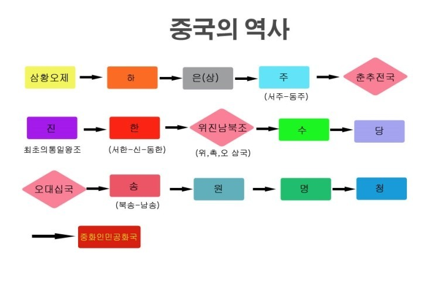
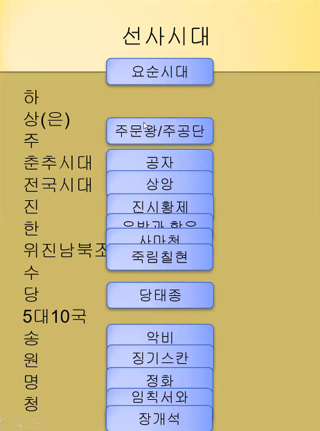

# 배경 지식의 가지치기
## 동양 = 고루하고 후진적?
이슬람 중심으로 형성되어 있던 `아바스 왕국`이 있던 바그다드의 인구수는 **100만**
- 당시 베네치아의 인구 수는 **4~5**만에 그침
`마르코 폴로` - 원나라의 발달된 문명과 인구수를 보고 충격을 받음

## 중국 소개
`국가 면적` : 세계 4위
`인구수` : 14억(56개 민족 중 한족이 94%)

## 중국의 지리와 지형
북방의 `황하`, 남방의 `장강`, 두 강 사이에 `회수` 강 줄기를 따라 문화 형성

## 중국의 역사
### 선사시대
### 역사시대

